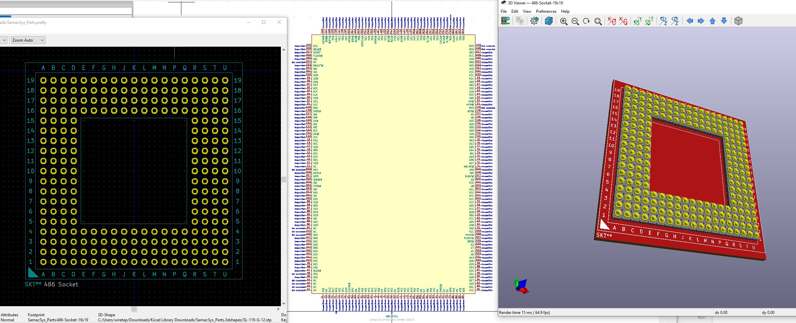

# 486 Pentium Overdrive Socket for KiCAD
I created the symbol and footprint files for a 486 Pentium Overdrive socket, for use in various projects.

## Info
Made in KiCAD v5.x -- you can import the symbol and footprint and assign the step files for the 3D model.
\
\
This socket is for the full 486 socket, based on the Pentium Overdrive pinout. For a normal 486, it sits in the middle with the outer rows of pins unoccupied. I figured this symbol and footprint may be useful if you're designing an interposer board or replica motherboard.
\
\
Open source / open hardware, feel free to do what you want with it.
